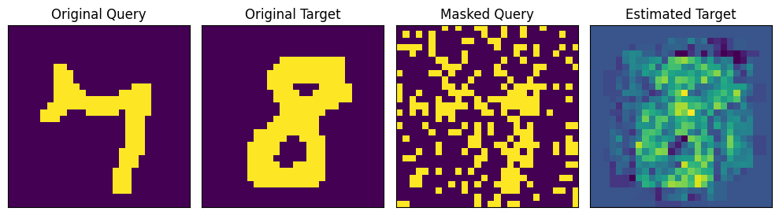

# bidirectional


<!-- WARNING: THIS FILE WAS AUTOGENERATED! DO NOT EDIT! -->

Bidirectional Associative Memories are a kind of recurrent neural
architecture which allows for *bidirectional* recall of stored
associated memory patterns. In particular, we will be implementing the
Nonlinear Dynamic Recurrent Associative Memory for Learning Bipolar and
Nonpolar Correlated Patterns (NDRAM) – a mouthful – as well as a
Bidirectional Heteroassociative Memory (BHM) based on NDRAM.

------------------------------------------------------------------------

<a
href="https://github.com/hanleyc01/MemoryModelAlmanac/blob/main/MemoryModelAlmanac/bidirectional.py#L24"
target="_blank" style="float:right; font-size:smaller">source</a>

### NDRAM

>  NDRAM (W:jaxtyping.Float[Array,'DD'], lr:float, tr:float)

*Nonlinear Dynamic Recurrent Associative Memory for Learning Bipolar and
Nonpolar Correlated Patterns.*

------------------------------------------------------------------------

<a
href="https://github.com/hanleyc01/MemoryModelAlmanac/blob/main/MemoryModelAlmanac/bidirectional.py#L86"
target="_blank" style="float:right; font-size:smaller">source</a>

### fit_ndram

>  fit_ndram (Xi:jaxtyping.Float[Array,'ND'], lr:float, tr:float,
>                 num_transmissions:int=1, nsteps:int=2000,
>                 key:jax.Array=Array([0, 0], dtype=uint32))

*Fit an NDRAM model to the dataset, returning a trained model.*

<table>
<colgroup>
<col style="width: 6%" />
<col style="width: 25%" />
<col style="width: 34%" />
<col style="width: 34%" />
</colgroup>
<thead>
<tr>
<th></th>
<th><strong>Type</strong></th>
<th><strong>Default</strong></th>
<th><strong>Details</strong></th>
</tr>
</thead>
<tbody>
<tr>
<td>Xi</td>
<td>Float[Array, ‘N D’]</td>
<td></td>
<td>The patterns to learn</td>
</tr>
<tr>
<td>lr</td>
<td>float</td>
<td></td>
<td>The learning rate parameter</td>
</tr>
<tr>
<td>tr</td>
<td>float</td>
<td></td>
<td>The transmission rate parameter</td>
</tr>
<tr>
<td>num_transmissions</td>
<td>int</td>
<td>1</td>
<td>Optional, number of transmission steps to undertake. Default:
<code>1</code>.</td>
</tr>
<tr>
<td>nsteps</td>
<td>int</td>
<td>2000</td>
<td>Number of training steps to undertake. Default:
<code>2_000</code>.</td>
</tr>
<tr>
<td>key</td>
<td>Array</td>
<td>[0 0]</td>
<td>Optional, default <code>jr.PRNGKey(0)</code>.</td>
</tr>
</tbody>
</table>

Fit uses the two equations which define the dynamics of NDRAM networks:
the weight update rule and the query update rule (1-2) (respectively).
The weight update rule is given by:
*W*<sub>(*k* + 1)</sub> = *W*<sub>(*k*)</sub> + *η*(*x*<sub>(0)</sub>*x*<sub>(0)</sub><sup>*T*</sup> − *x*<sub>(*t*)</sub>*x*<sub>(*t*)</sub><sup>*T*</sup>),
where *η* is the learning rate parameter, *W*<sub>(*k*)</sub> denotes
the weight matrix at time step *k*, *x*<sub>(0)</sub> denotes the query
buffer at the initial time step *t* = 0, and *x*<sub>(*t*)</sub> is the
current query buffer at time step *t*.

The query update rule is given by:
$$
\begin{align\*}
x_i^{(t+1)} &= f(a_i), \\
\text{where}~f(a_i) &= \begin{cases}
    1,&~\text{if}~a_i \> 1,\\
    -1,&~\text{if}~a_i \< -1, \\
    (\delta + 1)a_i - \delta a_i^3,&~\text{otherwise},
\end{cases}
\end{align\*}
\tag{2}
$$
with unfortunately a flipped notation here of
*x*<sub>*i*</sub><sup>(*t*)</sup> denoting the *i*’th element of the
query buffer at time *t*, and *δ* the *transmission rate*. These are
given by the following methods:

------------------------------------------------------------------------

<a
href="https://github.com/hanleyc01/MemoryModelAlmanac/blob/main/MemoryModelAlmanac/bidirectional.py#L33"
target="_blank" style="float:right; font-size:smaller">source</a>

### NDRAM.weight_update

>  NDRAM.weight_update (weights:jaxtyping.Float[Array,'DD'],
>                           query_0:jaxtyping.Float[Array,'D'],
>                           query_t:jaxtyping.Float[Array,'D'], lr:float)

*Perform a weight update.*

<table>
<thead>
<tr>
<th></th>
<th><strong>Type</strong></th>
<th><strong>Details</strong></th>
</tr>
</thead>
<tbody>
<tr>
<td>weights</td>
<td>Float[Array, ‘D D’]</td>
<td>The weights of the network.</td>
</tr>
<tr>
<td>query_0</td>
<td>Float[Array, ‘D’]</td>
<td>The initial query state time t = 0</td>
</tr>
<tr>
<td>query_t</td>
<td>Float[Array, ‘D’]</td>
<td>The current query state at time t</td>
</tr>
<tr>
<td>lr</td>
<td>float</td>
<td>The learning rate parameter</td>
</tr>
</tbody>
</table>

------------------------------------------------------------------------

<a
href="https://github.com/hanleyc01/MemoryModelAlmanac/blob/main/MemoryModelAlmanac/bidirectional.py#L46"
target="_blank" style="float:right; font-size:smaller">source</a>

### NDRAM.query_update

>  NDRAM.query_update (weights:jaxtyping.Float[Array,'DD'],
>                          query:jaxtyping.Float[Array,'D'], tr:float,
>                          num_transmissions=1)

*Perform a query update.*

<table>
<thead>
<tr>
<th></th>
<th><strong>Type</strong></th>
<th><strong>Default</strong></th>
<th><strong>Details</strong></th>
</tr>
</thead>
<tbody>
<tr>
<td>weights</td>
<td>Float[Array, ‘D D’]</td>
<td></td>
<td>The weights of the network</td>
</tr>
<tr>
<td>query</td>
<td>Float[Array, ‘D’]</td>
<td></td>
<td>The query state</td>
</tr>
<tr>
<td>tr</td>
<td>float</td>
<td></td>
<td>The transmission parameter</td>
</tr>
<tr>
<td>num_transmissions</td>
<td>int</td>
<td>1</td>
<td>Number of transmissions to perform.</td>
</tr>
</tbody>
</table>

# Example

``` python
DATA_DIR = "../data/mnist"

pxw, pxh = 28, 28


def transform(data):
    data = np.array(data, dtype=jnp.float64)
    data = rearrange(data, "w h -> (w h)")
    data[data > 0.0] = 1.0
    data[data == 0.0] = -1.0
    return data


mnist_train = MNIST(DATA_DIR, train=True, transform=transform)
mnist_data_loader = DataLoader(mnist_train, batch_size=128, shuffle=True)
mnist_it = iter(mnist_data_loader)
mnist_data, _ = next(mnist_it)
```

``` python
def mask(
    state: Float[Array, " D"], pct_mask: float = 0.3, key: jax.Array = jr.PRNGKey(11)
) -> Float[Array, " D"]:
    prange = np.array([pct_mask, 1 - pct_mask])
    return state * jr.choice(key, np.array([-1, 1]), p=prange, shape=state.shape)
    # noise = jr.normal(key, shape=(pxh* pxw,))
    # return query * noise


def show_im(im: Float[Array, " WH"], title: str = "") -> None:
    im = im * 255.0
    im = rearrange(im, "(w h) -> w h", w=pxw, h=pxh)
    plt.imshow(im)
    plt.title(title)
    plt.xticks([])
    plt.yticks([])


def show_weights(W, title=""):
    W = jax.block_until_ready(W).__array__()
    plt.imshow(W, cmap="viridis", aspect="auto")
    plt.title(title)
    plt.xticks([])
    plt.yticks([])


def display_pair(img1, img2, titles=["", ""]):
    images = [jnp.array(img).reshape(28, 28) for img in [img1, img2]]
    fig, axes = plt.subplots(1, 2, figsize=(5, 5))
    for i, ax in enumerate(axes):
        ax.imshow(images[i])
        ax.set_title(titles[i])
        ax.set_xticks([])
        ax.set_yticks([])
    plt.tight_layout()
    plt.show()


def display_recall(
    img1,
    img2,
    img3,
    titles=[
        "",
        "",
        "",
    ],
):
    images = [
        jnp.array(img).reshape(28, 28)
        for img in [
            img1,
            img2,
            img3,
        ]
    ]
    fig, axes = plt.subplots(1, 3, figsize=(10, 10))
    for i, ax in enumerate(axes):
        ax.imshow(images[i])
        ax.set_title(titles[i])
        ax.set_xticks([])
        ax.set_yticks([])
    plt.tight_layout()
    plt.show()


Xi = jnp.array(mnist_data[:13])
lr = 0.001
tr = 0.1
ndram, Ws = fit_ndram(Xi, lr, tr)
# show_weights(ndram.W, "Trained Weights")
```

``` python
query = Xi[9]
masked_query = mask(query, pct_mask=0.2, key=jr.PRNGKey(11))
est_query = ndram(masked_query)

display_recall(
    query, masked_query, est_query, ["Original Query", "Masked Query", "Recalled Value"]
)
```


# Bidirectional Heteroassociative Memory for Binary and Grey-level Patterns

Similar to the above, we will be implementing another associative
memory, except this time it will be a *Bidirectional* and
*Heteroassociative*. An associative memory is *bidirectional* if it
stores queries and targets, (*x*, *y*), and recall ℳ(*x*) = *y* and
ℳ(*y*) = *x*. An associative memory is *heteroassociative* (i.e., a
*heteroassociative memory*) if *x* ≠ *y*. The specific model is the
Bidirectional Heteroassociative Memory (BAM), from [Chartier & Boukadoum
(2006)](https://pubmed.ncbi.nlm.nih.gov/16566466/). Like NDRAM, BAM uses
an *online* learning rule. In honor of the first author, we will be
denoting this class with the name
[`Chartier`](https://hanleyc01.github.io/MemoryModelAlmanac/bidirectional.html#chartier).

------------------------------------------------------------------------

<a
href="https://github.com/hanleyc01/MemoryModelAlmanac/blob/main/MemoryModelAlmanac/bidirectional.py#L112"
target="_blank" style="float:right; font-size:smaller">source</a>

### Chartier

>  Chartier (W:jaxtyping.Float[Array,'DD'], V:jaxtyping.Float[Array,'DD'],
>                lr:float, tr:float)

*Bidirectional Hetero-associative Memory.*

------------------------------------------------------------------------

<a
href="https://github.com/hanleyc01/MemoryModelAlmanac/blob/main/MemoryModelAlmanac/bidirectional.py#L247"
target="_blank" style="float:right; font-size:smaller">source</a>

### fit_chartier

>  fit_chartier (A:jaxtyping.Float[Array,'ND'],
>                    P:jaxtyping.Float[Array,'ND'], lr:float, tr:float,
>                    nsteps:int=2000, num_transmissions:int=1,
>                    key:jax.Array=Array([0, 0], dtype=uint32))

*Create and fit a
[`Chartier`](https://hanleyc01.github.io/MemoryModelAlmanac/bidirectional.html#chartier)
network to the address and pattern matrices `A` and `P`.*

<table>
<colgroup>
<col style="width: 6%" />
<col style="width: 25%" />
<col style="width: 34%" />
<col style="width: 34%" />
</colgroup>
<thead>
<tr>
<th></th>
<th><strong>Type</strong></th>
<th><strong>Default</strong></th>
<th><strong>Details</strong></th>
</tr>
</thead>
<tbody>
<tr>
<td>A</td>
<td>Float[Array, ‘N D’]</td>
<td></td>
<td>The “address” matrix of patterns to store</td>
</tr>
<tr>
<td>P</td>
<td>Float[Array, ‘N D’]</td>
<td></td>
<td>The “backwards” matrix of patterns to store</td>
</tr>
<tr>
<td>lr</td>
<td>float</td>
<td></td>
<td>The learning rate</td>
</tr>
<tr>
<td>tr</td>
<td>float</td>
<td></td>
<td>The transmission rate</td>
</tr>
<tr>
<td>nsteps</td>
<td>int</td>
<td>2000</td>
<td>The number of learning steps to perform</td>
</tr>
<tr>
<td>num_transmissions</td>
<td>int</td>
<td>1</td>
<td>The number of transmission steps to perform</td>
</tr>
<tr>
<td>key</td>
<td>Array</td>
<td>[0 0]</td>
<td>Optional, default <code>jr.PRNGKey(0)</code></td>
</tr>
</tbody>
</table>

------------------------------------------------------------------------

<a
href="https://github.com/hanleyc01/MemoryModelAlmanac/blob/main/MemoryModelAlmanac/bidirectional.py#L122"
target="_blank" style="float:right; font-size:smaller">source</a>

### Chartier.forward_weight_update

>  Chartier.forward_weight_update (W:jaxtyping.Float[Array,'DD'],
>                                      x_0:jaxtyping.Float[Array,'D'],
>                                      x_t:jaxtyping.Float[Array,'D'],
>                                      y_0:jaxtyping.Float[Array,'D'],
>                                      y_t:jaxtyping.Float[Array,'D'], lr:float)

*Forward weight update.*

<table>
<colgroup>
<col style="width: 9%" />
<col style="width: 38%" />
<col style="width: 52%" />
</colgroup>
<thead>
<tr>
<th></th>
<th><strong>Type</strong></th>
<th><strong>Details</strong></th>
</tr>
</thead>
<tbody>
<tr>
<td>W</td>
<td>Float[Array, ‘D D’]</td>
<td>The “forward” weights</td>
</tr>
<tr>
<td>x_0</td>
<td>Float[Array, ‘D’]</td>
<td>Initial query, i.e. query at time <code>t = 0</code></td>
</tr>
<tr>
<td>x_t</td>
<td>Float[Array, ‘D’]</td>
<td>Query at time <code>t</code></td>
</tr>
<tr>
<td>y_0</td>
<td>Float[Array, ‘D’]</td>
<td>Initial target, target at time <code>t = 0</code>.</td>
</tr>
<tr>
<td>y_t</td>
<td>Float[Array, ‘D’]</td>
<td>Target at time <code>t</code>.</td>
</tr>
<tr>
<td>lr</td>
<td>float</td>
<td>Learning rate parameter</td>
</tr>
<tr>
<td><strong>Returns</strong></td>
<td><strong>Float[Array, ‘D D’]</strong></td>
<td><strong>Updated “forward” weights</strong></td>
</tr>
</tbody>
</table>

------------------------------------------------------------------------

<a
href="https://github.com/hanleyc01/MemoryModelAlmanac/blob/main/MemoryModelAlmanac/bidirectional.py#L140"
target="_blank" style="float:right; font-size:smaller">source</a>

### Chartier.backward_weight_update

>  Chartier.backward_weight_update (V:jaxtyping.Float[Array,'DD'],
>                                       x_0:jaxtyping.Float[Array,'D'],
>                                       x_t:jaxtyping.Float[Array,'D'],
>                                       y_0:jaxtyping.Float[Array,'D'],
>                                       y_t:jaxtyping.Float[Array,'D'],
>                                       lr:float)

<table>
<thead>
<tr>
<th></th>
<th><strong>Type</strong></th>
<th><strong>Details</strong></th>
</tr>
</thead>
<tbody>
<tr>
<td>V</td>
<td>Float[Array, ‘D D’]</td>
<td>The “backward” weights</td>
</tr>
<tr>
<td>x_0</td>
<td>Float[Array, ‘D’]</td>
<td>Initial query, i.e. query at time <code>t = 0</code></td>
</tr>
<tr>
<td>x_t</td>
<td>Float[Array, ‘D’]</td>
<td>Query at time <code>t</code></td>
</tr>
<tr>
<td>y_0</td>
<td>Float[Array, ‘D’]</td>
<td>Initial target, target at time <code>t = 0</code>.</td>
</tr>
<tr>
<td>y_t</td>
<td>Float[Array, ‘D’]</td>
<td>Target at time <code>t</code>.</td>
</tr>
<tr>
<td>lr</td>
<td>float</td>
<td>Learning rate parameter</td>
</tr>
<tr>
<td><strong>Returns</strong></td>
<td><strong>Float[Array, ‘D D’]</strong></td>
<td><strong>Updated backward weights</strong></td>
</tr>
</tbody>
</table>

------------------------------------------------------------------------

<a
href="https://github.com/hanleyc01/MemoryModelAlmanac/blob/main/MemoryModelAlmanac/bidirectional.py#L224"
target="_blank" style="float:right; font-size:smaller">source</a>

### Chartier.forward_pred

>  Chartier.forward_pred (x:jaxtyping.Float[Array,'D'],
>                             num_transmissions:int=1)

*Perform “forwards” recall.*

<table>
<colgroup>
<col style="width: 6%" />
<col style="width: 25%" />
<col style="width: 34%" />
<col style="width: 34%" />
</colgroup>
<thead>
<tr>
<th></th>
<th><strong>Type</strong></th>
<th><strong>Default</strong></th>
<th><strong>Details</strong></th>
</tr>
</thead>
<tbody>
<tr>
<td>x</td>
<td>Float[Array, ‘D’]</td>
<td></td>
<td>The forward query.</td>
</tr>
<tr>
<td>num_transmissions</td>
<td>int</td>
<td>1</td>
<td>The number of transmissions to perform.</td>
</tr>
<tr>
<td><strong>Returns</strong></td>
<td><strong>Float[Array, ‘D’]</strong></td>
<td></td>
<td><strong>The recalled target after
<code>num_transmissions</code></strong></td>
</tr>
</tbody>
</table>

------------------------------------------------------------------------

<a
href="https://github.com/hanleyc01/MemoryModelAlmanac/blob/main/MemoryModelAlmanac/bidirectional.py#L235"
target="_blank" style="float:right; font-size:smaller">source</a>

### Chartier.backward_pred

>  Chartier.backward_pred (y:jaxtyping.Float[Array,'D'],
>                              num_transmissions:int=1)

*Perform “backwards” recalll.*

<table>
<colgroup>
<col style="width: 6%" />
<col style="width: 25%" />
<col style="width: 34%" />
<col style="width: 34%" />
</colgroup>
<thead>
<tr>
<th></th>
<th><strong>Type</strong></th>
<th><strong>Default</strong></th>
<th><strong>Details</strong></th>
</tr>
</thead>
<tbody>
<tr>
<td>y</td>
<td>Float[Array, ‘D’]</td>
<td></td>
<td>The backwards query</td>
</tr>
<tr>
<td>num_transmissions</td>
<td>int</td>
<td>1</td>
<td>The number of transmissions to perform</td>
</tr>
<tr>
<td><strong>Returns</strong></td>
<td><strong>Float[Array, ‘D’]</strong></td>
<td></td>
<td><strong>The recalled query after
<code>num_transmissions</code>.</strong></td>
</tr>
</tbody>
</table>

[`Chartier`](https://hanleyc01.github.io/MemoryModelAlmanac/bidirectional.html#chartier)
models are created using
[`fit_chartier`](https://hanleyc01.github.io/MemoryModelAlmanac/bidirectional.html#fit_chartier).
This trains the model using the following procedure: 1. Select a random
query-target pair, 2. Compute their updated forms via the pattern update
rule, 3. Compute the updated weight matrices given these values, and, 4.
Repeat the steps for the number of steps provided.

# Example

``` python
A_mnist_data_loader = DataLoader(mnist_train, batch_size=13, shuffle=True)
A_mnist_it = iter(mnist_data_loader)
A, _ = next(mnist_it)
A = jnp.array(A)

P_mnist_data_loader = DataLoader(mnist_train, batch_size=13, shuffle=True)
P_mnist_it = iter(mnist_data_loader)
P, _ = next(mnist_it)
P = jnp.array(P)

lr = 0.001
tr = 0.1
chartier = fit_chartier(A, P, lr=lr, tr=tr, nsteps=2_000)
```

``` python
show_weights(chartier.W, "Forward Weights")
```


``` python
show_weights(chartier.V, "Backwards Weights")
```


## Example Recall

In order to test whether the system works, we will perform a forwards
and backwards recall for associated patterns.

``` python
def display_chartier_recall(img1, img2, img3, img4, titles=["", "", "", ""]):
    images = [jnp.array(img).reshape(28, 28) for img in [img1, img2, img3, img4]]
    fig, axes = plt.subplots(1, 4, figsize=(10, 10))
    for i, ax in enumerate(axes):
        ax.imshow(images[i])
        ax.set_title(titles[i])
        ax.set_xticks([])
        ax.set_yticks([])
    plt.tight_layout()
    plt.show()


query, target = A[0], P[0]
masked_query, masked_target = mask(query, 0.25), mask(target, 0.25)
display_pair(query, target, ["Original Query", "Original Target"])
```


``` python
display_pair(masked_query, masked_target, ["Masked Query", "Masked Target"])
```


``` python
est_target = chartier.forward_pred(masked_query)
display_chartier_recall(
    query,
    target,
    masked_query,
    est_target,
    ["Original Query", "Original Target", "Masked Query", "Estimated Target"],
)
```



``` python
est_query = chartier.backward_pred(masked_target)
display_chartier_recall(
    query,
    target,
    est_query,
    masked_target,
    ["Original Query", "Original Target", "Estimated Query", "Masked Target"],
)
```


