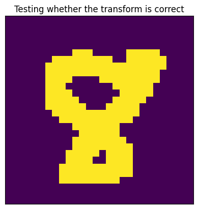
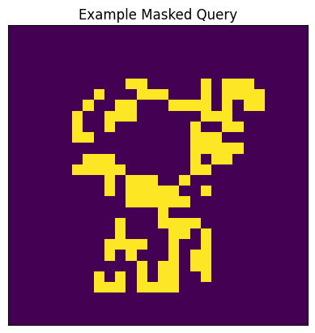
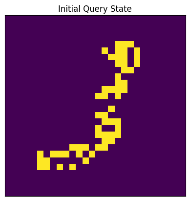
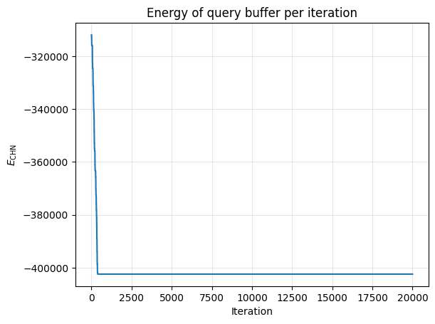
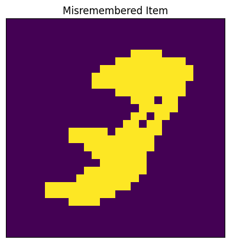
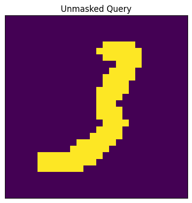
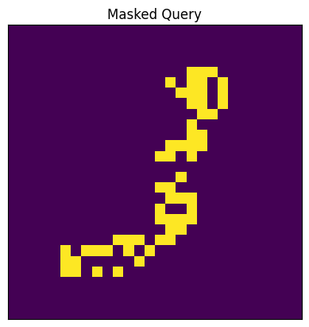
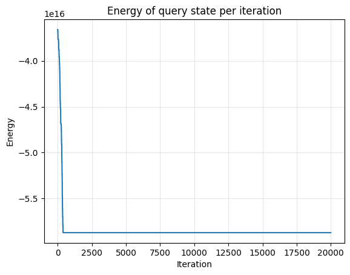

# hopfield


<!-- WARNING: THIS FILE WAS AUTOGENERATED! DO NOT EDIT! -->

In this module we implement classical binary Hopfield Networks as well
as Dense Associative Memories, which are both forms of *energy-based
Associative Memories*. Energy-based Associative Memories (AMs) are
recursive neural networks which are content-addressable memories. The
main bulk of the module is implemented using the tutorial at
[https://tutorial.amemory.net/tutorial/dense_storage.html]() as a
reference. Please read this first, as it contains much more information,
and the implementation is largely identical in layout and function.

# Generic Hopfield Networks

In it’s most generic case, defining an associative memory in the
Hopfield network-style requires only one thing: defining an *energy
function*. An energy function *E* is a function of the parameters of the
network to a real number *x*, ideally a measure of the global similarity
between the query state *ξ* and the stored traces *Ξ*. As we do
asynchronous recall with an energy-based AM, the network iteratively
reduces the energy of the query state by randomly “flipping a bit” of
the query state, iff flipping that bit *reduces the energy* of the query
state.

There are other important properties of the energy function of a
Hopfield network: namely, that it is *convex*. Convexity of the function
guarantees that there is some local minima in the “energy landscape”
(the range of the energy-function). Local minima in the energy landscape
are ideally equivalent to stored patterns in the network: however, if
the AM reaches *critical capacity*, then the local minima of the state
do not correspond to the stored patterns. These states are called
*spurious states*. Cognitively speaking, these can be situations in
which there is some kind of error in recall, giving us a pattern which
is unintelligible.

------------------------------------------------------------------------

<a
href="https://github.com/hanleyc01/MemoryModelAlmanac/blob/main/MemoryModelAlmanac/hopfield.py#L28"
target="_blank" style="float:right; font-size:smaller">source</a>

### GenericAM

>  GenericAM (Xi:jaxtyping.Float[Array,'KD'])

The two important functions here are
[`GenericAM.async_update`](https://hanleyc01.github.io/MemoryModelAlmanac/hopfield.html#genericam.async_update)
and
[`GenericAM.async_recall`](https://hanleyc01.github.io/MemoryModelAlmanac/hopfield.html#genericam.async_recall):

------------------------------------------------------------------------

<a
href="https://github.com/hanleyc01/MemoryModelAlmanac/blob/main/MemoryModelAlmanac/hopfield.py#L36"
target="_blank" style="float:right; font-size:smaller">source</a>

### GenericAM.async_update

>  GenericAM.async_update (current_query_state:jaxtyping.Float[Array,'D'],
>                              idx:int)

*Flip a bit in the current query state at given index if it lowers the
energy.*

------------------------------------------------------------------------

<a
href="https://github.com/hanleyc01/MemoryModelAlmanac/blob/main/MemoryModelAlmanac/hopfield.py#L49"
target="_blank" style="float:right; font-size:smaller">source</a>

### GenericAM.async_recall

>  GenericAM.async_recall (initial_query_state:jaxtyping.Float[Array,'D'],
>                              nsteps:int=20000, key:jax.Array=Array([0, 0],
>                              dtype=uint32))

*Iteratively update the initial query state in order to reduce its
energy.*

# Classical Hopfield Network

The Classical Hopfield network is the energy-based AM that was first
proposed in [Hopfield
(1982)](https://www.pnas.org/doi/10.1073/pnas.79.8.2554) and [Hopfield
(1984)](https://pubmed.ncbi.nlm.nih.gov/6587342/). It has an energy
function which describes the dot-product between the query state and the
stored patterns in the associative memory:
$$
E\_\text{CHN}(\sigma) = - \frac{1}{2} \sum\_{\mu} \left( \sum_i \xi^\mu_i \sigma_i \right)^2,
\tag{1}
$$
where each *ξ*<sup>*μ*</sup> is a stored pattern.

------------------------------------------------------------------------

<a
href="https://github.com/hanleyc01/MemoryModelAlmanac/blob/main/MemoryModelAlmanac/hopfield.py#L70"
target="_blank" style="float:right; font-size:smaller">source</a>

### ClassicalHopfield

>  ClassicalHopfield (Xi:jaxtyping.Float[Array,'KD'])

*Classical Hopfield Network defined by the energy function in equation
(1).*

------------------------------------------------------------------------

<a
href="https://github.com/hanleyc01/MemoryModelAlmanac/blob/main/MemoryModelAlmanac/hopfield.py#L75"
target="_blank" style="float:right; font-size:smaller">source</a>

### ClassicalHopfield.energy

>  ClassicalHopfield.energy (query:jaxtyping.Float[Array,'D'])

*Compute the energy of the `query` state.*

## Example

In order to demonstrate the efficacy (and shortcomings) of the classical
Hopfield Network, we will do a simple recall task using the MNIST
dataset.

``` python
DATA_DIR = "../data/mnist"

pxw, pxh = 28, 28


def transform(data):
    data = np.array(data, dtype=jnp.float32)
    data = rearrange(data, "w h -> (w h)")
    data[data > 0.0] = 1.0
    data[data == 0.0] = -1.0
    return data


mnist_train = MNIST(DATA_DIR, train=True, transform=transform)
mnist_data_loader = DataLoader(mnist_train, batch_size=128, shuffle=True)
mnist_it = iter(mnist_data_loader)
mnist_data, _ = next(mnist_it)
```

``` python
def show_im(im: Float[Array, " WH"], title: str = "") -> None:
    im = rearrange(im, "(w h) -> w h", w=pxw, h=pxh)
    plt.imshow(im)
    plt.title(title)
    plt.xticks([])
    plt.yticks([])


show_im(mnist_data[0], title="Testing whether the transform is correct")
```



``` python
def mask(
    state: Float[Array, " D"], pct_mask: float = 0.5, key: jax.Array = jr.PRNGKey(0)
) -> Float[Array, " D"]:
    D = state.shape[-1]
    bits_to_mask = jr.choice(key, np.arange(D), shape=(int(D * pct_mask),))
    return state.at[bits_to_mask].set(-1.0)


show_im(
    mask(jnp.array(mnist_data[0], dtype=jnp.float32), 0.5), title="Example Masked Query"
)
```



``` python
def iterate_recall(
    am: GenericAM,
    query_state: Float[Array, " D"],
    save: bool = True,
    key: jax.Array = jr.PRNGKey(0),
    **kwargs,
):
    final_query_state, (frames, energies) = am.async_recall(
        query_state, key=key, **kwargs
    )
    return final_query_state, (frames, energies)


Xi = jnp.array(mnist_data[:2], dtype=jnp.float32)
chn = ClassicalHopfield(Xi)
query = Xi[1]
masked_query = mask(query)
final_query_state, (frames, energies) = iterate_recall(chn, masked_query)

show_im(masked_query, "Initial Query State")
```



``` python
show_im(final_query_state, "Final Query State")
```


We can also plot out the energy of the network over time:

``` python
plt.plot(energies)
plt.title("Energy of query buffer per iteration")
plt.grid(True, alpha=0.3)
plt.xlabel("Iteration")
plt.ylabel(r"$E_\text{CHN}$")
plt.show()
```



To demonstrate the low critical capacity of this associative memory, we
really only need to introduce one more pattern:

``` python
Xi = jnp.array(mnist_data[:3])
chn = ClassicalHopfield(Xi)
query = Xi[1]
masked_query = mask(query)
final_query_state, (frames, energies) = iterate_recall(chn, masked_query)
show_im(masked_query, "Masked Image")
```


``` python
show_im(final_query_state, "Misremembered Item")
```



This is what I call the *omnidigit*. There is some interesting research
pointing towards the shift between generative capacities and memory
capacities after AMs reach their critical capacity, e.g. [Pham, *et al.*
(2025)](https://arxiv.org/abs/2505.21777) and a worked out tutorial
[here](https://tutorial.amemory.net/tutorial/diffusion_as_memory.html).
But, we will not be covering this here.

# Dense Associative Memories

While Hopfield networks are a wonderful discovery, they have a severe
limitation. Their *critical capacity* is, famously, around 0.14*N*,
where *N* is the number of patterns stored in the network. To overcome
this, a general framework for associative memories, called *Dense
Associative Memories* (DAMs) was proposed in [Krotov & Hopfield
(2016)](https://arxiv.org/abs/1606.01164). The key intuition behind the
increased capacity is to maximize the *separation* of stored patterns in
memory [Millidge, *et al.* (2022)](https://arxiv.org/abs/2202.04557).
Recall, energy-based AMs “misremember” stored patterns whenever the
local minima of the energy landscape become conjoined, i.e. the minima
do not correspond with the intended stored patterns. Thus, to increase
the capacity, we need to increase the distance between stored patterns.
In order to do this, Krotov & Hopfield (2016) found that if we introduce
a non-linearity into the energy function then we can make the network
“emphasize” high-similarities between the query vector and stored
patterns, and further “de-emphasize” low similarity values.

Single-shot AMs, which learn in one non-asynchronous pass, that perform
similar operations will be discussed in `01_minerva.ipynb`.

------------------------------------------------------------------------

<a
href="https://github.com/hanleyc01/MemoryModelAlmanac/blob/main/MemoryModelAlmanac/hopfield.py#L80"
target="_blank" style="float:right; font-size:smaller">source</a>

### DAM

>  DAM (Xi:jaxtyping.Float[Array,'KD'], polynomial:int, rectified:bool=True)

*Dense Associative Memory.*

The important function here is, of course, the *energy* function:

------------------------------------------------------------------------

<a
href="https://github.com/hanleyc01/MemoryModelAlmanac/blob/main/MemoryModelAlmanac/hopfield.py#L97"
target="_blank" style="float:right; font-size:smaller">source</a>

### DAM.energy

>  DAM.energy (query_state:jaxtyping.Float[Array,'D'])

*Compute the energy of the `query` state.*

The energy function takes on the general form of:
*E*<sub>DAM</sub>(*σ*) = −∑<sub>*μ*</sub>(∑<sub>*i*</sub>*F*<sub>*n*</sub>(*ξ*<sub>*i*</sub><sup>*μ*</sup>*σ*<sub>*i*</sub>)),
where *F*<sub>*n*</sub> is the polynomial of order *n*, which increases
separation.

------------------------------------------------------------------------

<a
href="https://github.com/hanleyc01/MemoryModelAlmanac/blob/main/MemoryModelAlmanac/hopfield.py#L89"
target="_blank" style="float:right; font-size:smaller">source</a>

### DAM.F_n

>  DAM.F_n (sims:jaxtyping.Float[Array,'D'])

*The polynomial function inside of the energy function.*

<table>
<thead>
<tr>
<th></th>
<th><strong>Type</strong></th>
<th><strong>Details</strong></th>
</tr>
</thead>
<tbody>
<tr>
<td>sims</td>
<td>Float[Array, ‘D’]</td>
<td>The dot-product similarity scores</td>
</tr>
</tbody>
</table>

## Example

Like we did with the Classical Hopfield network, we will also show an
example. This time, however, we will include a lot more stored patterns
in order to demonstrate that the associative memory has a higher
critical capacity.

``` python
Xi = jnp.array(mnist_data[:10])
dam = DAM(Xi, polynomial=6, rectified=True)
query = Xi[1]
show_im(query, "Unmasked Query")
```



``` python
masked_query = mask(query)
show_im(masked_query, "Masked Query")
```



``` python
final_query_state, (frames, energies) = iterate_recall(dam, masked_query)
show_im(final_query_state, "Final Query State")
```


``` python
plt.plot(energies)
plt.title("Energy of query state per iteration")
plt.grid(True, alpha=0.3)
plt.xlabel("Iteration")
plt.ylabel("Energy")
plt.show()
```


