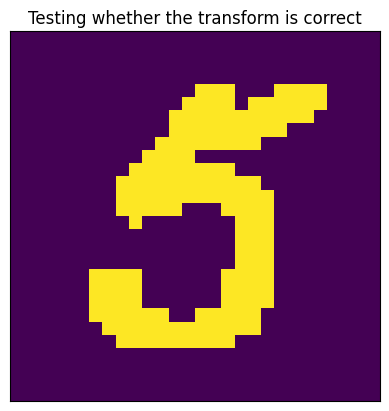
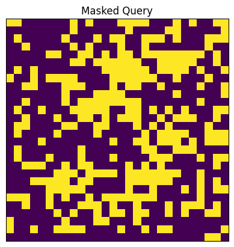
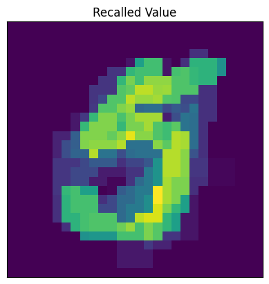
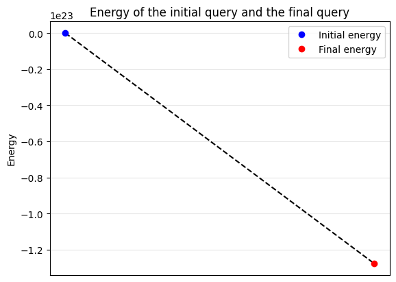
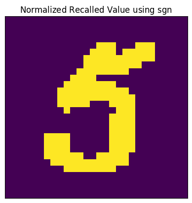
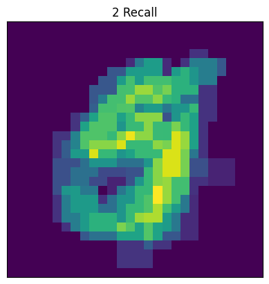
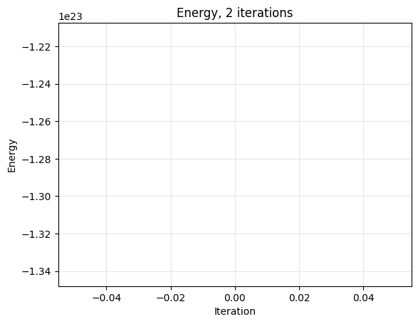
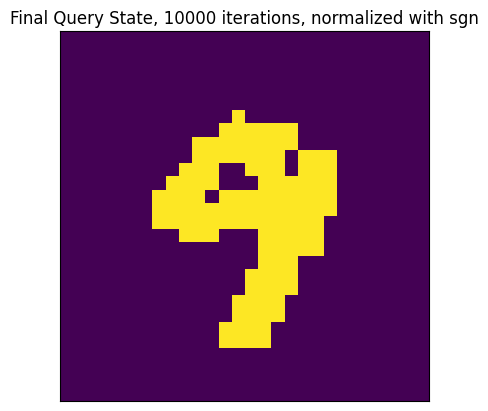
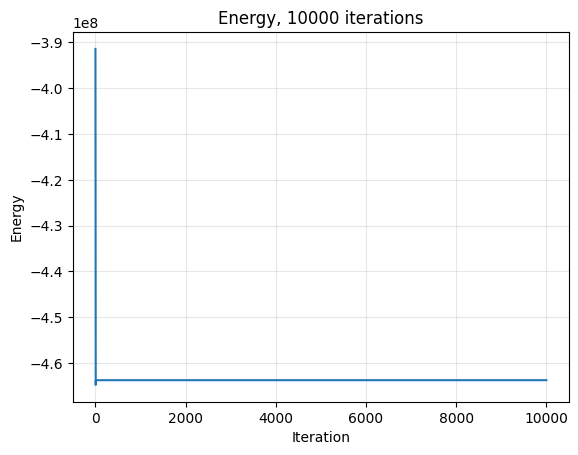

# minerva


<!-- WARNING: THIS FILE WAS AUTOGENERATED! DO NOT EDIT! -->

In this module we will be implementing Minerva models, which are a class
of associative memory models with deep theoretical connections to
Hopfield networks. What distinguishes them is that they are developed
expicitly for the cognitive science context as a model of human memory.
Unifying all of these models is the tensor-based framework proposed in
[Kelly, *et al.*
(2017)](https://www.sciencedirect.com/science/article/pii/S0022249616301122).

# Minerva2

Similar to Hopfield networks, the original Minerva model proposed by
[Hintzman (1984)](https://link.springer.com/article/10.3758/BF03202365),
MINERVA2, uses integer values. The main difference is that we allow for
0 values (denoting absent “features”). The recall function for MINERVA2
is given by:
$$
\mathcal{M}\_\mathsf{Minerva2}(\sigma) = \sum^N\_{i=1} \xi^i \left\[ \frac{1}{D} \left( \sum^D\_{j=1} \xi^i_j \sigma_j \right)^3 \right\]
$$

------------------------------------------------------------------------

<a
href="https://github.com/hanleyc01/MemoryModelAlmanac/blob/main/MemoryModelAlmanac/minerva.py#L24"
target="_blank" style="float:right; font-size:smaller">source</a>

### Minerva2

>  Minerva2 (Xi:jaxtyping.Float[Array,'KD'], polynomial:int=3)

------------------------------------------------------------------------

<a
href="https://github.com/hanleyc01/MemoryModelAlmanac/blob/main/MemoryModelAlmanac/minerva.py#L28"
target="_blank" style="float:right; font-size:smaller">source</a>

### Minerva2.sims

>  Minerva2.sims (query_state:jaxtyping.Float[Array,'D'])

*Compute the similarities between a query probe and the stored memory
traces.*

<table>
<thead>
<tr>
<th></th>
<th><strong>Type</strong></th>
<th><strong>Details</strong></th>
</tr>
</thead>
<tbody>
<tr>
<td>query_state</td>
<td>Float[Array, ‘D’]</td>
<td>The query “probe”</td>
</tr>
<tr>
<td><strong>Returns</strong></td>
<td><strong>Float[Array, ‘D’]</strong></td>
<td></td>
</tr>
</tbody>
</table>

------------------------------------------------------------------------

<a
href="https://github.com/hanleyc01/MemoryModelAlmanac/blob/main/MemoryModelAlmanac/minerva.py#L36"
target="_blank" style="float:right; font-size:smaller">source</a>

### Minerva2.recall

>  Minerva2.recall (query_state:jaxtyping.Float[Array,'D'])

*Simulate recall of a query by reconstructing it as a linear combination
of the stored patterns.*

<table>
<thead>
<tr>
<th></th>
<th><strong>Type</strong></th>
<th><strong>Details</strong></th>
</tr>
</thead>
<tbody>
<tr>
<td>query_state</td>
<td>Float[Array, ‘D’]</td>
<td>The query “probe”</td>
</tr>
<tr>
<td><strong>Returns</strong></td>
<td><strong>Float[Array, ‘D’]</strong></td>
<td></td>
</tr>
</tbody>
</table>

MINERVA2 has a deep relationship with Hopfield networks, as they are
formulated from the energy-based AM perspective. Implicitly operating
here is an energy function defined as the anti-derivative of
[`Minerva2.recall`](https://hanleyc01.github.io/MemoryModelAlmanac/minerva.html#minerva2.recall).

------------------------------------------------------------------------

<a
href="https://github.com/hanleyc01/MemoryModelAlmanac/blob/main/MemoryModelAlmanac/minerva.py#L54"
target="_blank" style="float:right; font-size:smaller">source</a>

### Minerva2.energy

>  Minerva2.energy (query:jaxtyping.Float[Array,'D'])

*Compute the energy of `query`.*

<table>
<thead>
<tr>
<th></th>
<th><strong>Type</strong></th>
<th><strong>Details</strong></th>
</tr>
</thead>
<tbody>
<tr>
<td>query</td>
<td>Float[Array, ‘D’]</td>
<td>The query “probe”</td>
</tr>
</tbody>
</table>

------------------------------------------------------------------------

<a
href="https://github.com/hanleyc01/MemoryModelAlmanac/blob/main/MemoryModelAlmanac/minerva.py#L54"
target="_blank" style="float:right; font-size:smaller">source</a>

### Minerva2.energy

>  Minerva2.energy (query:jaxtyping.Float[Array,'D'])

*Compute the energy of `query`.*

<table>
<thead>
<tr>
<th></th>
<th><strong>Type</strong></th>
<th><strong>Details</strong></th>
</tr>
</thead>
<tbody>
<tr>
<td>query</td>
<td>Float[Array, ‘D’]</td>
<td>The query “probe”</td>
</tr>
</tbody>
</table>

``` python
DATA_DIR = "../data/mnist"

pxw, pxh = 28, 28


def transform(data):
    data = np.array(data, dtype=jnp.float64)
    data = rearrange(data, "w h -> (w h)")
    data[data > 0.0] = 1.0
    data[data == 0.0] = -1.0
    return data


mnist_train = MNIST(DATA_DIR, train=True, transform=transform)
mnist_data_loader = DataLoader(mnist_train, batch_size=128, shuffle=True)
mnist_it = iter(mnist_data_loader)
mnist_data, _ = next(mnist_it)
```

``` python
def show_im(im: Float[Array, " WH"], title: str = "") -> None:
    im = rearrange(im, "(w h) -> w h", w=pxw, h=pxh)
    plt.imshow(im)
    plt.title(title)
    plt.xticks([])
    plt.yticks([])


show_im(mnist_data[1], title="Testing whether the transform is correct")
```



``` python
def mask(
    state: Float[Array, " D"], pct_mask: float = 0.3, key: jax.Array = jr.PRNGKey(0)
) -> Float[Array, " D"]:
    prange = np.array([pct_mask, 1-pct_mask])
    return state * jr.choice(key, np.array([-1, 1]), p=prange, shape=state.shape)


Xi = jnp.array(mnist_data[:7])
min2 = Minerva2(Xi, polynomial=3)
query = Xi[1]
masked_query = mask(query)
show_im(masked_query, "Masked Query")
```

    ERROR:2025-09-09 15:32:44,038:jax._src.xla_bridge:487: Jax plugin configuration error: Exception when calling jax_plugins.xla_cuda12.initialize()
    Traceback (most recent call last):
      File "/home/pop-harrier/Documents/Cogsci/MemoryModelAlmanac/.venv/lib/python3.13/site-packages/jax/_src/xla_bridge.py", line 485, in discover_pjrt_plugins
        plugin_module.initialize()
        ~~~~~~~~~~~~~~~~~~~~~~~~^^
      File "/home/pop-harrier/Documents/Cogsci/MemoryModelAlmanac/.venv/lib/python3.13/site-packages/jax_plugins/xla_cuda12/__init__.py", line 328, in initialize
        _check_cuda_versions(raise_on_first_error=True)
        ~~~~~~~~~~~~~~~~~~~~^^^^^^^^^^^^^^^^^^^^^^^^^^^
      File "/home/pop-harrier/Documents/Cogsci/MemoryModelAlmanac/.venv/lib/python3.13/site-packages/jax_plugins/xla_cuda12/__init__.py", line 285, in _check_cuda_versions
        local_device_count = cuda_versions.cuda_device_count()
    RuntimeError: jaxlib/cuda/versions_helpers.cc:113: operation cuInit(0) failed: CUDA_ERROR_UNKNOWN
    WARNING:2025-09-09 15:32:44,042:jax._src.xla_bridge:864: An NVIDIA GPU may be present on this machine, but a CUDA-enabled jaxlib is not installed. Falling back to cpu.



For our first test, we will simply show that it *can* recall:

``` python
recalled_value = min2.recall(masked_query)
show_im(recalled_value, "Recalled Value")
```



Intuitively we can see that the value 4 is *preferred* as the most
similar value. However, we also another interesting property of MINERVA2
compared to Hopfield networks. Rather than asynchronously updating
random bits in the query state, we rather form recalled values as
weighted sums of the stored traces, where the weight is the correlation
between the query provided and the patterns.

We can also compare the energy of the initial state and the final state:

``` python
initial_energy = min2.energy(masked_query)
initial_energy
```

    Array(-1.8811876e+07, dtype=float32)

``` python
final_energy = min2.energy(recalled_value)
final_energy
```

    Array(-1.2777563e+23, dtype=float32)

``` python
initial_energy = min2.energy(masked_query)
final_energy = min2.energy(recalled_value)
energies = [initial_energy, final_energy]
plt.plot(energies, color="black", linestyle="--")
plt.xticks([])
plt.ylabel("Energy")
plt.title("Energy of the initial query and the final query")
plt.plot(0, initial_energy, "bo", label="Initial energy")
plt.plot(1, final_energy, "ro", label="Final energy")
plt.grid(True, alpha=0.3)
plt.legend()
plt.show()
```



Another interesting thing about Minerva2 recall is that while it is
normalized by the dimensionality of the stored patterns *D*, we can
normalize it by more familiar methods. For example, if we instead
normalize recalled patterns using sgn, we get near-perfect recall (and
near identical performance to DAM models withs single-shot recall).

``` python
normalized_recalled_value = jnp.sign(recalled_value)
show_im(normalized_recalled_value, r"Normalized Recalled Value using $\text{sgn}$")
```



### Iterative Recall

We can think of the single-shot recall performed by Minerva2 as a
“collapsed” asynchronous recall which is performed over the indices
*i* = 1, …, *D*, where *D* is the dimensionality of the pattern vectors.
Hintzman, however, notes that we might also want to perform iterated
recall similar to the element-wise asynchronous recall of Hopfield
networks, except updating each *i* every single time. Whenever we do not
normalize the recalled value with sgn, we do not get very meaningful
results:

------------------------------------------------------------------------

<a
href="https://github.com/hanleyc01/MemoryModelAlmanac/blob/main/MemoryModelAlmanac/minerva.py#L63"
target="_blank" style="float:right; font-size:smaller">source</a>

### Minerva2.iterative_recall

>  Minerva2.iterative_recall (query:jaxtyping.Float[Array,'D'],
>                                 nsteps:int=200, normalize_with_sgn:bool=False)

*Iteratively perform recall on a query state.*

<table>
<colgroup>
<col style="width: 6%" />
<col style="width: 25%" />
<col style="width: 34%" />
<col style="width: 34%" />
</colgroup>
<thead>
<tr>
<th></th>
<th><strong>Type</strong></th>
<th><strong>Default</strong></th>
<th><strong>Details</strong></th>
</tr>
</thead>
<tbody>
<tr>
<td>query</td>
<td>Float[Array, ‘D’]</td>
<td></td>
<td>The query “probe”</td>
</tr>
<tr>
<td>nsteps</td>
<td>int</td>
<td>200</td>
<td>How many iterations you want to perform</td>
</tr>
<tr>
<td>normalize_with_sgn</td>
<td>bool</td>
<td>False</td>
<td>Whether or not to normalize the recalled value with
<code>jnp.sign</code>.</td>
</tr>
<tr>
<td><strong>Returns</strong></td>
<td><strong>None</strong></td>
<td></td>
<td></td>
</tr>
</tbody>
</table>

------------------------------------------------------------------------

<a
href="https://github.com/hanleyc01/MemoryModelAlmanac/blob/main/MemoryModelAlmanac/minerva.py#L63"
target="_blank" style="float:right; font-size:smaller">source</a>

### Minerva2.iterative_recall

>  Minerva2.iterative_recall (query:jaxtyping.Float[Array,'D'],
>                                 nsteps:int=200, normalize_with_sgn:bool=False)

*Iteratively perform recall on a query state.*

<table>
<colgroup>
<col style="width: 6%" />
<col style="width: 25%" />
<col style="width: 34%" />
<col style="width: 34%" />
</colgroup>
<thead>
<tr>
<th></th>
<th><strong>Type</strong></th>
<th><strong>Default</strong></th>
<th><strong>Details</strong></th>
</tr>
</thead>
<tbody>
<tr>
<td>query</td>
<td>Float[Array, ‘D’]</td>
<td></td>
<td>The query “probe”</td>
</tr>
<tr>
<td>nsteps</td>
<td>int</td>
<td>200</td>
<td>How many iterations you want to perform</td>
</tr>
<tr>
<td>normalize_with_sgn</td>
<td>bool</td>
<td>False</td>
<td>Whether or not to normalize the recalled value with
<code>jnp.sign</code>.</td>
</tr>
<tr>
<td><strong>Returns</strong></td>
<td><strong>None</strong></td>
<td></td>
<td></td>
</tr>
</tbody>
</table>

``` python
nsteps = 2
final_query_state, (frames, energies) = min2.iterative_recall(
    masked_query, nsteps=nsteps
)
show_im(final_query_state, title=f"{nsteps} Recall")
```



``` python
plt.plot(energies)
plt.title(f"Energy, {nsteps} iterations")
plt.xlabel("Iteration")
plt.ylabel("Energy")
plt.grid(True, alpha=0.3)
plt.show()
```



There is a decrease in energy, but the recalled trace is not at all
close to our desired pattern (a handwritten 4). If we do not normalize
the value at the end, however, then we get exploding values to ∞ or NaN
(undefined values), as we can see with the following:

``` python
nsteps = 4
final_query_state, (frames, energies) = min2.iterative_recall(
    masked_query, nsteps=nsteps
)
final_query_state.max()
```

    Array(nan, dtype=float32)

To solve this problem, we can introduce sgn normalization into the
iterated recall:

``` python
nsteps = 10_000
final_query_state, (frames, energies) = min2.iterative_recall(
    masked_query, nsteps=nsteps, normalize_with_sgn=True,
)
show_im(final_query_state, f"Final Query State, {nsteps} iterations, normalized with sgn")
```



``` python
plt.plot(energies)
plt.title(f"Energy, {nsteps} iterations")
plt.xlabel("Iteration")
plt.ylabel("Energy")
plt.grid(True, alpha=0.3)
plt.show()
```



# Holographic Minerva

``` python
# TODO: implement holographic minerva model
```

# Vector Intersector Units

``` python
# TODO: implement vector intersector units
```
